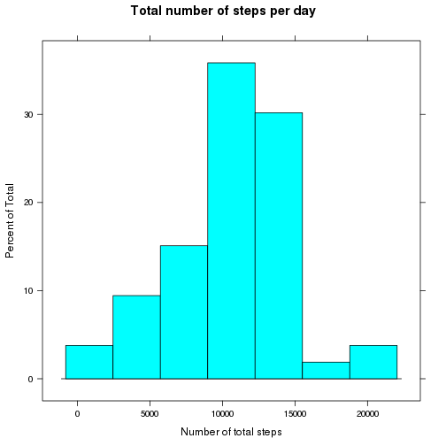
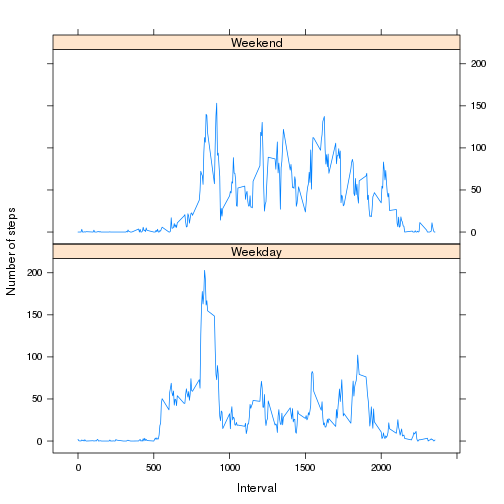

## Loading the required libraries


```r
library(dplyr)
library(lattice)
```


## Download the dataset


```r
url <- "https://d396qusza40orc.cloudfront.net/repdata%2Fdata%2Factivity.zip"
download.file(url, "data.zip")
unzip("data.zip")
```

## Read and clean the data

* The NA values will be omitted


```r
activity <- read.csv("activity.csv")
activity <- na.omit(activity)
activity$date <- as.Date(activity$date)
group.activity <- group_by(activity, date) %>% summarise(total = sum(steps),
                                                         mean = mean(steps), median = median(steps))
```

## Plot the histogram of total steps per day


```r
histogram(group.activity$total, main = "Total number of steps per day", xlab = "Number of total steps")
```



## Show the mean of steps taken each day 

* The transpose shows all the data groups.


```r
t(group.activity[,3:4])
```

```
##          [,1]     [,2]     [,3]     [,4]     [,5]     [,6]     [,7]   [,8]
## mean   0.4375 39.41667 42.06944 46.15972 53.54167 38.24653 44.48264 34.375
## median 0.0000  0.00000  0.00000  0.00000  0.00000  0.00000  0.00000  0.000
##            [,9]    [,10]    [,11]    [,12]    [,13]  [,14]    [,15]
## mean   35.77778 60.35417 43.14583 52.42361 35.20486 52.375 46.70833
## median  0.00000  0.00000  0.00000  0.00000  0.00000  0.000  0.00000
##           [,16]    [,17]    [,18]    [,19]    [,20]    [,21]    [,22]
## mean   34.91667 41.07292 36.09375 30.62847 46.73611 30.96528 29.01042
## median  0.00000  0.00000  0.00000  0.00000  0.00000  0.00000  0.00000
##           [,23]    [,24]    [,25]    [,26]    [,27]    [,28]    [,29]
## mean   8.652778 23.53472 35.13542 39.78472 17.42361 34.09375 53.52083
## median 0.000000  0.00000  0.00000  0.00000  0.00000  0.00000  0.00000
##           [,30]    [,31]    [,32]   [,33]    [,34]    [,35]    [,36]
## mean   36.80556 36.70486 36.24653 28.9375 44.73264 11.17708 43.77778
## median  0.00000  0.00000  0.00000  0.0000  0.00000  0.00000  0.00000
##           [,37]    [,38]     [,39]    [,40]    [,41]    [,42]    [,43]
## mean   37.37847 25.47222 0.1423611 18.89236 49.78819 52.46528 30.69792
## median  0.00000  0.00000 0.0000000  0.00000  0.00000  0.00000  0.00000
##           [,44]    [,45]    [,46]    [,47]    [,48]    [,49]    [,50]
## mean   15.52778 44.39931 70.92708 73.59028 50.27083 41.09028 38.75694
## median  0.00000  0.00000  0.00000  0.00000  0.00000  0.00000  0.00000
##           [,51]    [,52]    [,53]
## mean   47.38194 35.35764 24.46875
## median  0.00000  0.00000  0.00000
```

## Plot time series: mean of steps per interval across all the days


```r
group.5minute <- group_by(activity, interval) %>% summarise(mean = mean(steps, na.rm = TRUE))
with(group.5minute, plot(interval, mean, type = "l",
                         main = "Mean of steps per interval across all the days",
                         xlab = "Interval", ylab = "Mean of steps"))
```


## The 5-minute interval that, on average, contains the maximum number of steps


```r
filter(group.5minute,mean == max(group.5minute$mean))[1]
```

```
## # A tibble: 1 × 1
##   interval
##      <int>
## 1      835
```

## Imputing missing values

The number of missing values in this dataset is 2304


```r
activity.na <- read.csv("activity.csv")
sum(is.na(activity.na))
```

```
## [1] 2304
```

## Imputing missing data solution

####The strategy for filling in all of the missing data is to fill of the mean for that 5-minute interval

* take the lines with NA values


```r
activity.na$date <- as.Date(activity.na$date)
na_steps <- is.na(activity.na$steps)
na_interval <- activity.na[na_steps, 3]
```

* This function calculate mean of the 5-minute interval for that NA value


```r
fun <- function(na.interval, activity.na) {
    i = 1
    result <- data.frame()
    for(index in na.interval) {
        temp <- filter(activity.na, interval == index) %>% summarise(mean = mean(steps, na.rm = TRUE))
        result[i,1] <- temp
        i = i+1
    }
    result
}
```

* Replace the NA values with the respective mean of the 5-minute interval value


```r
intervals <- fun(na_interval, activity.na)
activity.na[na_steps,1] <- intervals[1]
group.activity.na <- group_by(activity.na, date) %>% summarise(total = sum(steps),
                                                         mean = mean(steps), median = median(steps))
```

## Histogram of the total number of steps taken each day after missing values are imputed


```r
histogram(group.activity.na$total, main = "Total number of steps per day after missing values imputed", xlab = "Number of total steps")
```


The transpose shows all the data groups.


```r
t(group.activity.na[,3:4])
```

```
##            [,1]   [,2]     [,3]     [,4]     [,5]     [,6]     [,7]
## mean   37.38260 0.4375 39.41667 42.06944 46.15972 53.54167 38.24653
## median 34.11321 0.0000  0.00000  0.00000  0.00000  0.00000  0.00000
##            [,8]     [,9]  [,10]    [,11]    [,12]    [,13]    [,14]
## mean   37.38260 44.48264 34.375 35.77778 60.35417 43.14583 52.42361
## median 34.11321  0.00000  0.000  0.00000  0.00000  0.00000  0.00000
##           [,15]  [,16]    [,17]    [,18]    [,19]    [,20]    [,21]
## mean   35.20486 52.375 46.70833 34.91667 41.07292 36.09375 30.62847
## median  0.00000  0.000  0.00000  0.00000  0.00000  0.00000  0.00000
##           [,22]    [,23]    [,24]    [,25]    [,26]    [,27]    [,28]
## mean   46.73611 30.96528 29.01042 8.652778 23.53472 35.13542 39.78472
## median  0.00000  0.00000  0.00000 0.000000  0.00000  0.00000  0.00000
##           [,29]    [,30]    [,31]    [,32]    [,33]    [,34]    [,35]
## mean   17.42361 34.09375 53.52083 37.38260 36.80556 36.70486 37.38260
## median  0.00000  0.00000  0.00000 34.11321  0.00000  0.00000 34.11321
##           [,36]   [,37]    [,38]    [,39]    [,40]    [,41]    [,42]
## mean   36.24653 28.9375 44.73264 11.17708 37.38260 37.38260 43.77778
## median  0.00000  0.0000  0.00000  0.00000 34.11321 34.11321  0.00000
##           [,43]    [,44]    [,45]     [,46]    [,47]    [,48]    [,49]
## mean   37.37847 25.47222 37.38260 0.1423611 18.89236 49.78819 52.46528
## median  0.00000  0.00000 34.11321 0.0000000  0.00000  0.00000  0.00000
##           [,50]    [,51]    [,52]    [,53]    [,54]    [,55]    [,56]
## mean   30.69792 15.52778 44.39931 70.92708 73.59028 50.27083 41.09028
## median  0.00000  0.00000  0.00000  0.00000  0.00000  0.00000  0.00000
##           [,57]    [,58]    [,59]    [,60]    [,61]
## mean   38.75694 47.38194 35.35764 24.46875 37.38260
## median  0.00000  0.00000  0.00000  0.00000 34.11321
```

## Panel plot comparing the average number of steps taken per 5-minute interval across weekdays and weekends


```r
weekdays <- weekdays(activity.na$date, TRUE)
f2 <- function(x) if(x %in% c("Sat","Sun")) "Weekend" else "Weekday"
activity.na$week.factor <- sapply(weekdays, f2)
group.activity.na <- group_by(activity.na, interval, week.factor) %>% summarise(mean = mean(steps))
xyplot(mean~interval | week.factor,
       data = group.activity.na,
       layout = c(1,2),
       xlab = "Interval",
       ylab = "Number of steps",
       type = "l")
```


